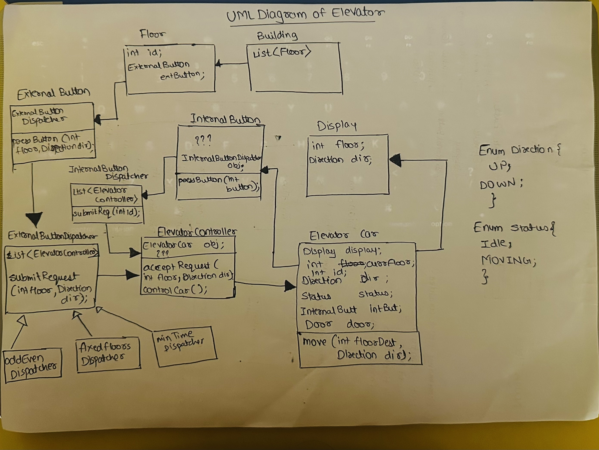

# LLD of Elevator System

Objects - 
1. Building
2. Floor
3. External Buttons
4. External Dispatcher
5. Internal Buttons
6. Internal Dispatcher
7. Elevator Controller (no.of lifts == no. elevator contrtollers)
8. Display
9. Elevator car( a dumb object, which will perform based on our input)
10. Direction (Enum class Up/Down)
11. Status (Enum class Idle, Moving)

Below id the UML Diagram -

